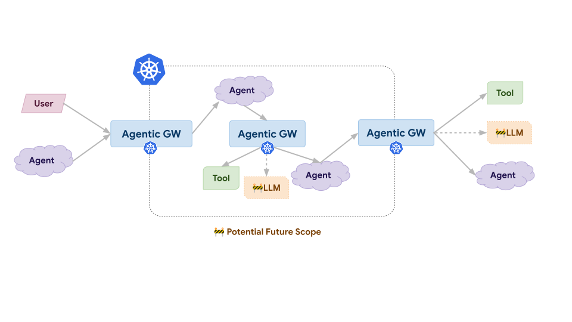

# kube-agentic-networking

This subproject aims to deliver the following:

**Core Capabilities**

-   Provide standardized APIs for secure, governed communication between agents, tools, and potentially LLMs across Kubernetes cluster boundaries (ingress, egress, and east-west traffic)
    
-   Attempt to design APIs around user-facing goals (e.g., "Agent A can communicate with Tool B") rather than protocol-specific constructs, ensuring adaptability as new AI-first protocols emerge alongside MCP and A2A
    
-   Enable protocol-aware networking capabilities where necessary (e.g., MCP tool-level authorization) while keeping core APIs protocol-agnostic and future-proof
    
-   Establish agent identity and authentication mechanisms that allow agents to be uniquely identified and verified across network boundaries
    

**Security & Governance**

-   Define authorization policies that control which agents can communicate with other agents, tools, and LLMs at a granular level (e.g., specific MCP tool functions)
    
-   Integrate AI safety and security extension points to support external authentication, authorization, and policy enforcement decisions
    
-   Provide auditable traffic management capabilities (rate limiting, access controls) suitable for autonomous agent workloads
    

**Ecosystem Integration**

-   Maintain alignment and collaboration with Gateway API, Gateway Inference Extension, WG AI Gateway, and WG AI Integration
    
-   Design APIs extensible enough for diverse implementations (service meshes, gateways, future architectures)

## Repository structure

- **Proposals and design docs:** [docs/proposals/](docs/proposals/) — Design proposals (e.g. `0008-ToolAuthAPI.md`). See [docs/proposals/README.md](docs/proposals/README.md) for naming and index.
- **APIs:** [api/](api/) — Go API types (XBackend, XAccessPolicy). CRDs in [k8s/crds/](k8s/crds/). Overview: [docs/api/README.md](docs/api/README.md).
- **Full layout:** [docs/REPO_STRUCTURE.md](docs/REPO_STRUCTURE.md) — Where to add proposals, APIs, and other content.

## Community, discussion, contribution, and support

Our community meetings are held weekly on Thursday at 4PM UTC ([Convert to your timezone](http://www.thetimezoneconverter.com/?t=4PM&tz=UTC)).
- [Meeting Notes](https://docs.google.com/document/d/1EQET_VWe_IAINyQhVj-wduZg99gBaObpz9612eZ1iYg/edit?tab=t.0#heading=h.q1zi45aa3n69)
- [Zoom (client) Meeting Link](https://zoom.us/j/92037420986)
- [Zoom (web) Meeting Link](https://zoom.us/wc/join/92037420986)

You can reach the maintainers of this project at:

- [Slack channel (#sig-network-agentic-networking)](https://kubernetes.slack.com/archives/C09P6KS6EQZ)
- [Mailing List](https://groups.google.com/a/kubernetes.io/g/sig-network)

Contributions are readily welcomed!

Learn how to engage with the Kubernetes community on the [community page](http://kubernetes.io/community/).

### Code of conduct

Participation in the Kubernetes community is governed by the [Kubernetes Code of Conduct](code-of-conduct.md).
