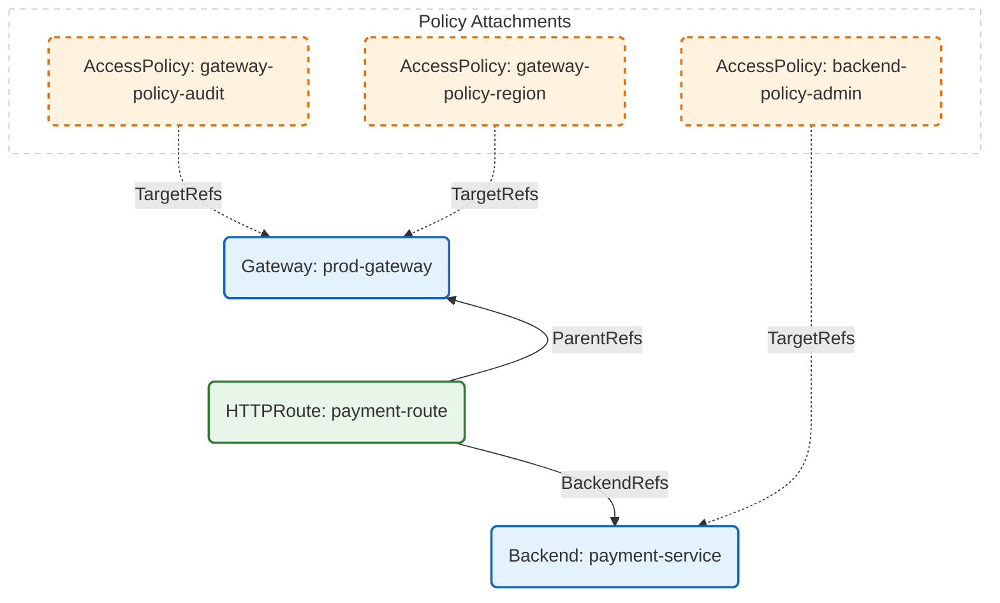

Date: 3rd February 2026<br/>
Authors: haiyanmeng<br/>
Status: Provisional<br/>

# Allow AccessPolicy to Target Gateway Objects

Currently, the [AccessPolicy](https://github.com/kubernetes-sigs/kube-agentic-networking/blob/main/docs/proposals/0008-ToolAuthAPI.md#accesspolicy-crd) resource is only allowed to target [Backends](https://github.com/kubernetes-sigs/kube-agentic-networking/blob/main/docs/proposals/0008-ToolAuthAPI.md#backend-crd).

This has scalability issues when a given Tool Authorization policy needs to be enforced for all the traffic managed by a [Gateway](https://gateway-api.sigs.k8s.io/api-types/gateway/) object.

This proposal allows `AccessPolicy` to target `Gateway` objects, in addition to `Backend` objects with following restrictions:

1. A single `AccessPolicy` object targeting a Gateway and a Backend at the same time is NOT allowed.

1. It is allowed to have `AccessPolicy` objects targeting a `Gateway` object and `AccessPolicy` objects targeting a `Backend` object behind the `Gateway` object. In this case, the `AccessPolicy` objects targeting the `Gateway` object will be evaluated first. Among the `AccessPolicy` objects targeting the `Gateway` object, the ones with earlier creationTimestamp will be evaluated first. For the policies with the same creationTimestamp, the ones appearing first in alphabetical order by `{namespace}/{name}` will be evaluated first.  
    
    * If any of the `AccessPolicy` objects targeting the `Gateway` object denies the access, the HTTP request will be denied. The `AccessPolicy` objects targeting the `Backend` object will NOT be evaluated in this case.

    * If all the `AccessPolicy` objects targeting the `Gateway` object allow the access, the `AccessPolicy` objects targeting the `Backend` object will be evaluated. Among the `AccessPolicy` objects targeting the `Backend` object, the ones with earlier creationTimestamp will be evaluated first. For the policies with the same creationTimestamp, the ones appearing first in alphabetical order by `{namespace}/{name}` will be evaluated first.  

        * if any of the `AccessPolicy` objects targeting the `Backend` object denies the access, the HTTP request will be denied.

        * if all the `AccessPolicy` objects targeting the `Backend` object allow the access, the HTTP request will be allowed.

## Example

Consider the following setup:

We have a Gateway, an HTTPRoute and a Backend:

*   **Gateway**: `prod-gateway`
*   **HTTPRoute**: `payment-route` (attached to `prod-gateway`, routes to `payment-service`)
*   **Backend**: `payment-service`

We also have the following AccessPolicies applied:

1.  `gateway-policy-audit` (Targets `prod-gateway`). Created at T1.
2.  `gateway-policy-region` (Targets `prod-gateway`). Created at T2 (T1 < T2).
3.  `backend-policy-admin` (Targets `payment-service`).

The graph shows the relationships between these resources:




### Evaluation Flow

When a request comes to `payment-service` through `prod-gateway`:

1.  **Gateway Level Checks:**
    *   First, `gateway-policy-audit` is evaluated (earlier creation timestamp).
    *   Next, `gateway-policy-region` is evaluated.
    *   **Rule:** ALL Gateway policies must allow the request. If `gateway-policy-audit` denies it, the request is rejected immediately, and subsequent policies are skipped.

2.  **Backend Level Checks:**
    *   If (and only if) all Gateway policies allow the request, `backend-policy-admin` is evaluated.
    *   **Rule:** Backend policies must also allow the request.

**Final Result:** The request is allowed ONLY if it is allowed by all three policies.

## API Changes

We will use `+kubebuilder:validation:XValidation:rule` markers to make sure that:

* A `targetRef` must be either `Gateway` or `Backend`.
* All targetRefs must have the same kind.

```
// AccessPolicySpec defines the desired state of AccessPolicy.
type AccessPolicySpec struct {
	// TargetRefs specifies the targets of the AccessPolicy.
	// An AccessPolicy must target at least one resource.
	// +required
	// +kubebuilder:validation:MinItems=1
	// +listType=atomic
	// +kubebuilder:validation:XValidation:rule="self.all(x, (x.group == 'agentic.prototype.x-k8s.io' && x.kind == 'XBackend') || (x.group == 'gateway.networking.k8s.io' && x.kind == 'Gateway'))",message="TargetRef must have group agentic.prototype.x-k8s.io and kind XBackend, or group gateway.networking.k8s.io and kind Gateway"
	// +kubebuilder:validation:XValidation:rule="self.all(ref, ref.kind == self[0].kind)",message="All targetRefs must have the same Kind"
	TargetRefs []gwapiv1.LocalPolicyTargetReference `json:"targetRefs"`
```

## Support requirements in implementation

* An implementation MUST support allowing AccessPolicy to target `Gateway` objects.

* An implementation MAY support allowing AccessPolicy to target `Backend` objects.

* If an implementation supports allowing AccessPolicy to target both `Gateway` and `Backend` objects, it MUST support the evaluation flow described above.
