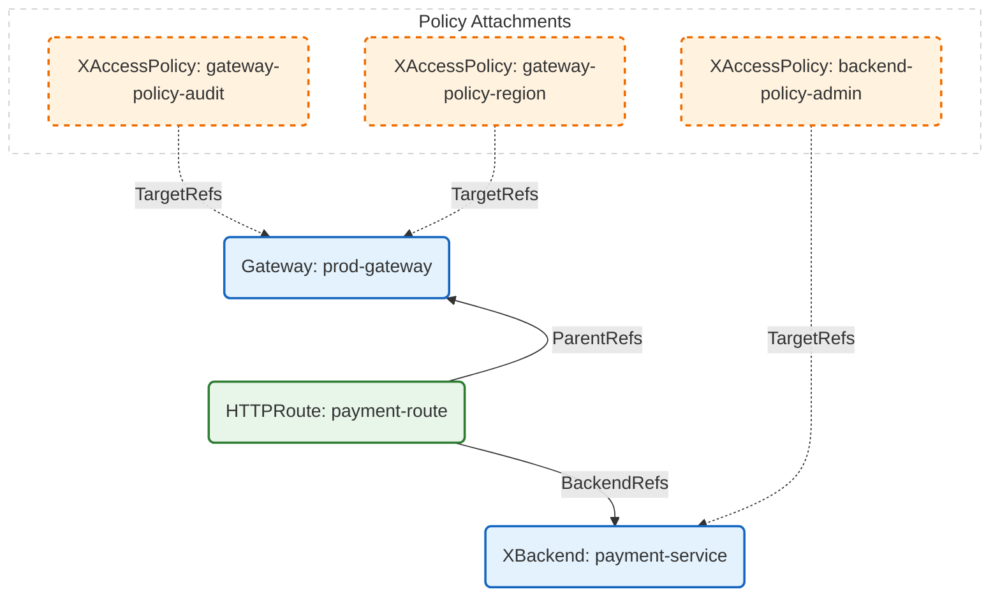

Date: 3rd February 2026<br/>
Authors: haiyanmeng<br/>
Status: Provisional<br/>

# Allow AccessPolicy to Target Gateway Objects

Currently, the [XAccessPolicy](https://github.com/kubernetes-sigs/kube-agentic-networking/blob/main/api/v1alpha1/accesspolicy_types.go) resource is only allowed to target [XBackends](https://github.com/kubernetes-sigs/kube-agentic-networking/blob/main/api/v0alpha0/backend_types.go).

This has scalability issues when a given Tool Authorization policy needs to be enforced for all the traffic managed by a [Gateway](https://gateway-api.sigs.k8s.io/api-types/gateway/) object.

This proposal allows `XAccessPolicy` to target `Gateway` objects, in addition to `XBackend` objects with following restrictions:

1. A single `XAccessPolicy` object targeting a Gateway and a XBackend at the same time is NOT allowed.

1. It is allowed to have `XAccessPolicy` objects targeting a `Gateway` object and `XAccessPolicy` objects targeting a `XBackend` object behind the `Gateway` object. In this case, the `XAccessPolicy` objects targeting the `Gateway` object will be evaluated first. Among the `XAccessPolicy` objects targeting the `Gateway` object, the ones with earlier creationTimestamp will be evaluated first. For the policies with the same creationTimestamp, the ones appearing first in alphabetical order by `{namespace}/{name}` will be evaluated first.

    * If any of the `XAccessPolicy` objects targeting the `Gateway` object denies the access, the HTTP request will be denied. The `XAccessPolicy` objects targeting the `XBackend` object will NOT be evaluated in this case.

    * If all the `XAccessPolicy` objects targeting the `Gateway` object allow the access, the `XAccessPolicy` objects targeting the `XBackend` object will be evaluated. Among the `XAccessPolicy` objects targeting the `XBackend` object, the ones with earlier creationTimestamp will be evaluated first. For the policies with the same creationTimestamp, the ones appearing first in alphabetical order by `{namespace}/{name}` will be evaluated first.

        * if any of the `XAccessPolicy` objects targeting the `XBackend` object denies the access, the HTTP request will be denied.

        * if all the `XAccessPolicy` objects targeting the `XBackend` object allow the access, the HTTP request will be allowed.

## Example

Consider the following setup:

We have a Gateway, an HTTPRoute and a Backend:

*   **Gateway**: `prod-gateway`
*   **HTTPRoute**: `payment-route` (attached to `prod-gateway`, routes to `payment-service`)
*   **XBackend**: `payment-service`

We also have the following XAccessPolicies applied:

1.  `gateway-policy-audit` (Targets `prod-gateway`). Created at T1.
2.  `gateway-policy-region` (Targets `prod-gateway`). Created at T2 (T1 < T2).
3.  `backend-policy-admin` (Targets `payment-service` XBackend).

The graph shows the relationships between these resources:


```mermaid
graph TD
    %% 1. Policies at the Top
    subgraph PolicyLayer [Policy Attachments]
        direction LR
        GPA1(XAccessPolicy: gateway-policy-audit)
        GPR1(XAccessPolicy: gateway-policy-region)
        BPA1(XAccessPolicy: backend-policy-admin)
    end

    %% 2. Infrastructure & Routing on the same line
    %% We define the order here: Gateway <-> Route <-> Backend
    GW(Gateway: prod-gateway)
    Route(HTTPRoute: payment-route)
    BE(XBackend: payment-service)

    %% Invisible links to force horizontal alignment
    GW ~~~ Route ~~~ BE

    %% 3. Vertical Arrows (Policies pointing DOWN)
    GPA1 -. "TargetRefs" .-> GW
    GPR1 -. "TargetRefs" .-> GW
    BPA1 -. "TargetRefs" .-> BE

    %% 4. Horizontal Arrows (Routing logic)
    Route -- "ParentRefs" --> GW
    Route -- "BackendRefs" --> BE

    %% --- STYLING ---
    classDef infra fill:#e3f2fd,stroke:#1565c0,stroke-width:2px;
    classDef routing fill:#e8f5e9,stroke:#2e7d32,stroke-width:2px;
    classDef policy fill:#fff3e0,stroke:#ef6c00,stroke-width:2px,stroke-dasharray: 5 5;

    class GW,BE infra;
    class Route routing;
    class GPA1,GPR1,BPA1 policy;
    style PolicyLayer fill:none,stroke:#ccc,stroke-dasharray: 5 5;
```


### Evaluation Flow

When a request comes to `payment-service` through `prod-gateway`:

1.  **Gateway Level Checks:**
    *   First, `gateway-policy-audit` is evaluated (earlier creation timestamp).
    *   Next, `gateway-policy-region` is evaluated.
    *   **Rule:** ALL Gateway policies must allow the request. If `gateway-policy-audit` denies it, the request is rejected immediately, and subsequent policies are skipped.

2.  **Backend Level Checks:**
    *   If (and only if) all Gateway policies allow the request, `backend-policy-admin` is evaluated.
    *   **Rule:** Backend policies must also allow the request.

**Final Result:** The request is allowed ONLY if it is allowed by all three policies.

## API Changes

We will use `+kubebuilder:validation:XValidation:rule` markers to make sure that:

* A `targetRef` must be either `Gateway` or `Backend`.
* All targetRefs must have the same kind.

```
// AccessPolicySpec defines the desired state of AccessPolicy.
type AccessPolicySpec struct {
	// TargetRefs specifies the targets of the AccessPolicy.
	// An AccessPolicy must target at least one resource.
	// +required
	// +kubebuilder:validation:MinItems=1
	// +listType=atomic
	// +kubebuilder:validation:XValidation:rule="self.all(x, (x.group == 'agentic.networking.x-k8s.io' && x.kind == 'XBackend') || (x.group == 'gateway.networking.k8s.io' && x.kind == 'Gateway'))",message="TargetRef must have group agentic.networking.x-k8s.io and kind XBackend, or group gateway.networking.k8s.io and kind Gateway"
    // +kubebuilder:validation:XValidation:rule="self.all(ref, ref.kind == self[0].kind)",message="All targetRefs must have the same Kind"
	TargetRefs []gwapiv1.LocalPolicyTargetReferenceWithSectionName `json:"targetRefs"`
}
```

In v1alpha1, the `Inline` authorization type uses `mcp.methods` (for example, `tools/call` with `params`) instead of a flat tool name list. This works well for `XAccessPolicy` targeting `XBackend` objects. It does not work well for `XAccessPolicy` targeting `Gateway` objects, because there could be tool name conflicts between different backends behind the same `Gateway`. We will address this in a separate proposal.

## Support requirements in implementation

* An implementation MUST support at least one of the following:

    * `XAccessPolicy` objects targeting `Gateway` objects
    * `XAccessPolicy` objects targeting `XBackend` objects

* If an implementation supports allowing `XAccessPolicy` to target both `Gateway` and `XBackend` objects, it MUST support the evaluation flow described above.
