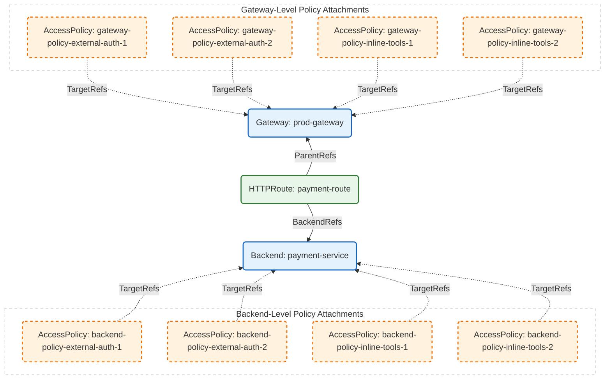

Date: 3rd April 2026<br/>
Authors: haiyanmeng<br/>
Status: Provisional<br/>

# Allow AccessPolicy to Target Gateway Objects

Currently, the [AccessPolicy](https://github.com/kubernetes-sigs/kube-agentic-networking/blob/main/docs/proposals/0008-ToolAuthAPI.md#accesspolicy-crd) resource is only allowed to target [Backends](https://github.com/kubernetes-sigs/kube-agentic-networking/blob/main/docs/proposals/0008-ToolAuthAPI.md#backend-crd).

This has scalability issues when a given Tool Authorization policy needs to be enforced for all the traffic managed by a [Gateway](https://gateway-api.sigs.k8s.io/api-types/gateway/) object.

This proposal allows `AccessPolicy` to target `Gateway` objects, in addition to `Backend` objects with following restrictions:

1. A single `AccessPolicy` object targeting a Gateway and a Backend at the same time is NOT allowed.

1. It is allowed to have `AccessPolicy` objects targeting a `Gateway` object and `AccessPolicy` objects targeting a `Backend` object behind the `Gateway` object. In this case, the `AccessPolicy` objects targeting the `Gateway` object will be evaluated first. Among the `AccessPolicy` objects targeting the `Gateway` object, the [ExternalAuth-type](https://github.com/kubernetes-sigs/kube-agentic-networking/blob/cf8c85b85d067657a5dce7b87270f8099f1e302c/api/v0alpha0/accesspolicy_types.go#L169) authorization rules matching the request, if exist, will be evaluated first, the request will be denied if the evaluation result of any of the ExternalAuth-type authorization rules is `deny`. If there are no [InlineTools-type](https://github.com/kubernetes-sigs/kube-agentic-networking/blob/cf8c85b85d067657a5dce7b87270f8099f1e302c/api/v0alpha0/accesspolicy_types.go#L165) authorization rules matching the request, allow the request. If any InlineTools-type authorization rule matching the request exists, allow the request. Otherwise, deny the request.


    * If the HTTP request is denied at the gateway-level evaluation, the `AccessPolicy` objects targeting the `Backend` object will NOT be evaluated.

    * If the HTTP request is allowed at the gateway-level evaluation, the `AccessPolicy` objects targeting the `Backend` object will be evaluated. Among the `AccessPolicy` objects targeting the `Backend` object, the [ExternalAuth-type](https://github.com/kubernetes-sigs/kube-agentic-networking/blob/cf8c85b85d067657a5dce7b87270f8099f1e302c/api/v0alpha0/accesspolicy_types.go#L169) authorization rules matching the request, if exist, will be evaluated first, the request will be denied if the evaluation result of any of the ExternalAuth-type authorization rules is `deny`. If there are no [InlineTools-type](https://github.com/kubernetes-sigs/kube-agentic-networking/blob/cf8c85b85d067657a5dce7b87270f8099f1e302c/api/v0alpha0/accesspolicy_types.go#L165) authorization rules matching the request, allow the request. If any InlineTools-type authorization rule matching the request exists, allow the request. Otherwise, deny the request.

## Summary Table

The following table summarizes the evaluation results for different combinations of policy checks. Note that evaluation short-circuits as soon as a definitive Deny or Allow is reached.

| Gateway ExternalAuth | Gateway InlineTools | Backend ExternalAuth | Backend InlineTools | Final Result |
| :--- | :--- | :--- | :--- | :--- |
| **Deny** (Any denies) | - | - | - | **Deny** |
| **Allow** (All allow) | **Deny** (All deny) | - | - | **Deny** |
| **Allow** (All allow) | **Allow** (At least one allows) | **Deny** (Any denies) | - | **Deny** |
| **Allow** (All allow) | **Allow** (At least one allows) | **Allow** (All allow) | **Deny** (All deny) | **Deny** |
| **Allow** (All allow) | **Allow** (At least one allows) | **Allow** (All allow) | **Allow** (At least one allows) | **Allow** |

## Example

Consider the following setup:

We have a Gateway, an HTTPRoute and a Backend:

*   **Gateway**: `prod-gateway`
*   **HTTPRoute**: `payment-route` (attached to `prod-gateway`, routes to `payment-service`)
*   **Backend**: `payment-service`

We also have the following AccessPolicies applied:

1.  `gateway-policy-external-auth-1` (Targets `prod-gateway`).
2.  `gateway-policy-external-auth-2` (Targets `prod-gateway`).
3.  `gateway-policy-inline-tools-1` (Targets `prod-gateway`).
4.  `gateway-policy-inline-tools-2` (Targets `prod-gateway`).
5.  `backend-policy-external-auth-1` (Targets `payment-service`).
6.  `backend-policy-external-auth-2` (Targets `payment-service`).
7.  `backend-policy-inline-tools-1` (Targets `payment-service`).
8.  `backend-policy-inline-tools-2` (Targets `payment-service`).

The graph shows the relationships between these resources:


```mermaid
graph TD
    %% 1. Policies at the Top
    subgraph PolicyLayer [Gateway-Level Policy Attachments]
        direction LR
        GPA1(AccessPolicy: gateway-policy-external-auth-1)
        GPA2(AccessPolicy: gateway-policy-external-auth-2)
        GPR1(AccessPolicy: gateway-policy-inline-tools-1)
        GPR2(AccessPolicy: gateway-policy-inline-tools-2)
    end

    %% 2. Infrastructure & Routing on the same line
    %% We define the order here: Gateway <-> Route <-> Backend
    GW(Gateway: prod-gateway)
    Route(HTTPRoute: payment-route)
    BE(Backend: payment-service)

    %% Invisible links to force horizontal alignment
    GW ~~~ Route ~~~ BE

    %% 3. Vertical Arrows (Policies pointing DOWN)
    GPA1 -. "TargetRefs" .-> GW
    GPA2 -. "TargetRefs" .-> GW
    GPR1 -. "TargetRefs" .-> GW
    GPR2 -. "TargetRefs" .-> GW

    %% 4. Horizontal Arrows (Routing logic)
    Route -- "ParentRefs" --> GW
    Route -- "BackendRefs" --> BE

    %% 5. Backend Policy at the Bottom
    subgraph BackendPolicyLayer [Backend-Level Policy Attachments]
        direction LR
        BPA1(AccessPolicy: backend-policy-external-auth-1)
        BPA2(AccessPolicy: backend-policy-external-auth-2)
        BPI1(AccessPolicy: backend-policy-inline-tools-1)
        BPI2(AccessPolicy: backend-policy-inline-tools-2)
    end

    %% Target arrows
    BPA1 -. "TargetRefs" .-> BE
    BPA2 -. "TargetRefs" .-> BE
    BPI1 -. "TargetRefs" .-> BE
    BPI2 -. "TargetRefs" .-> BE
    
    %% Force BackendPolicyLayer below BE
    BE ~~~ BPA1
    BE ~~~ BPA2
    BE ~~~ BPI1
    BE ~~~ BPI2

    %% --- STYLING ---
    classDef infra fill:#e3f2fd,stroke:#1565c0,stroke-width:2px;
    classDef routing fill:#e8f5e9,stroke:#2e7d32,stroke-width:2px;
    classDef policy fill:#fff3e0,stroke:#ef6c00,stroke-width:2px,stroke-dasharray: 5 5;

    class GW,BE infra;
    class Route routing;
    class GPA1,GPR1,GPA2,GPR2,BPA1,BPA2,BPI1,BPI2 policy;
    style PolicyLayer fill:none,stroke:#ccc,stroke-dasharray: 5 5;
    style BackendPolicyLayer fill:none,stroke:#ccc,stroke-dasharray: 5 5;
```


### Evaluation Flow

When a request comes to `payment-service` through `prod-gateway`:

1.  **Gateway Level Checks:**
    *   First, ExternalAuth policies are evaluated: `gateway-policy-external-auth-1` and `gateway-policy-external-auth-2`. If any of them denies the request, the request is rejected immediately, and subsequent policies are skipped. If all of them allow the request, proceed to the next evaluation phase.
        * The evaluation order of these ExternalAuth policies does not matter. An implementation may choose to evaluate them in any order.
    *   Second, InlineTools policies are evaluated: `gateway-policy-inline-tools-1` and `gateway-policy-inline-tools-2`. If any of them allows the request, proceed to the next evaluation phase. If all of them deny the request, the request is rejected immediately, and the Backend-level policies are skipped.
        * The evaluation order of these InlineTools policies does not matter. An implementation may choose to evaluate them in any order.

2.  **Backend Level Checks:**
    *   First, ExternalAuth policies are evaluated: `backend-policy-external-auth-1` and `backend-policy-external-auth-2`. If any of them denies the request, the request is rejected immediately, and subsequent policies are skipped. If all of them allow the request, proceed to the next evaluation phase.
        * The evaluation order of these ExternalAuth policies does not matter. An implementation may choose to evaluate them in any order.
    *   Second, InlineTools policies are evaluated: `backend-policy-inline-tools-1` and `backend-policy-inline-tools-2`. If any of them allows the request, allow the request. If all of them deny the request, deny the request.
        * The evaluation order of these InlineTools policies does not matter. An implementation may choose to evaluate them in any order.


## API Changes

We will use `+kubebuilder:validation:XValidation:rule` markers to make sure that:

* A `targetRef` must be either `Gateway` or `Backend`.
* All targetRefs must have the same kind.

```
// AccessPolicySpec defines the desired state of AccessPolicy.
type AccessPolicySpec struct {
	// TargetRefs specifies the targets of the AccessPolicy.
	// An AccessPolicy must target at least one resource.
	// +required
	// +kubebuilder:validation:MinItems=1
	// +listType=atomic
	// +kubebuilder:validation:XValidation:rule="self.all(x, (x.group == 'agentic.prototype.x-k8s.io' && x.kind == 'XBackend') || (x.group == 'gateway.networking.k8s.io' && x.kind == 'Gateway'))",message="TargetRef must have group agentic.prototype.x-k8s.io and kind XBackend, or group gateway.networking.k8s.io and kind Gateway"
    // +kubebuilder:validation:XValidation:rule="self.all(ref, ref.kind == self[0].kind)",message="All targetRefs must have the same Kind"
	TargetRefs []gwapiv1.LocalPolicyTargetReference `json:"targetRefs"`
}
```

In addition, to make it easy for users to understand why a tool access is allowed or denied, we will disallow the combination of `InlineTools` and `ExternalAuth` in the same `AccessPolicy`.

Currently, the `InlineTools` type of [AuthorizationRule](https://github.com/kubernetes-sigs/kube-agentic-networking/blob/main/docs/proposals/0017-DynamicAuth.md) supports a list of tool names, which works well for `AccessPolicy` targeting `Backend` objects. However, it does not work well for `AccessPolicy` targeting `Gateway` objects, because there could be tool name conflicts between different backends behind the same `Gateway`. We will address this in a separate proposal.

## Support requirements in implementation

* An implementation MUST support at least one of the following:

    * `AccessPolicy` objects targeting `Gateway` objects
    * `AccessPolicy` objects targeting `Backend` objects

* If an implementation supports allowing `AccessPolicy` to target both `Gateway` and `Backend` objects, it MUST support the evaluation flow described above.

## Prior Art

### Istio Authorization Policy

[Istio Authorization Policy](https://istio.io/latest/docs/reference/config/security/authorization-policy/) supports CUSTOM, DENY and ALLOW actions for access control. When CUSTOM, DENY and ALLOW actions are used for a workload at the same time, the CUSTOM action is evaluated first, then the DENY action, and finally the ALLOW action. The evaluation is determined by the following rules:

* If there are any CUSTOM policies that match the request, evaluate and deny the request if the evaluation result is deny.
* If there are any DENY policies that match the request, deny the request.
* If there are no ALLOW policies for the workload, allow the request.
* If any of the ALLOW policies match the request, allow the request.
* Deny the request.

### Envoy Gateway Security Policy

[Envoy Gateway Security Policy](https://gateway.envoyproxy.io/docs/api/extension_types/#securitypolicy) supports external authorization and internal authorization. When both are configured, the evaluation is determined by the following rules:

* If the external authorization rule denies the request, deny the request. If the external authorization rule allows the request, proceed to the next evaluation phase.
* The internal authorization rules are checked from top to bottom as they appear in the `SecurityPolicy` resource. The first rule that matches the request is applied, and all subsequent rules are ignored.
* If no intenral authorization rules match, the gateway applies the `defaultAction` (which is `Deny` by default).

#### The Precedence Hierarchy

When multiple `SecurityPolicy` resources apply to the same request, Envoy Gateway determines which one takes effect based on where they are attached:

| Level | Target Resource | Precedence |
|-------|-----------------|------------|
| Highest | Route Rule (via `sectionName`) | 1 (Wins all) |
| High | `HTTPRoute` / `GRPCRoute` | 2 |
| Medium | `Gateway` Listener (via `sectionName`) | 3 |
| Lowest | `Gateway` (Entire resource) | 4 |

#### Handling Conflicts (Same Level)

If two different `SecurityPolicy` objects target the exact same resource (e.g., two policies both targeting `HTTPRoute: my-service`), Envoy Gateway uses "Tie-breaking" rules:

* Oldest Wins: The policy with the earliest `creationTimestamp` is applied.

* Alphabetical Sorting: If the timestamps are identical, the policy whose name comes first alphabetically wins.

* Status Reporting: The "losing" policies will show a status of Overridden=True or Conflicted=True in their Kubernetes status field.

### Linkerd Authorization Policy

[Linkerd Authorization Policy](https://linkerd.io/2-edge/reference/authorization-policy/) evaluation follows a "Specific-to-General" hierarchy that centers around the concept of a `Server` resource.

Linkerd's proxy makes an authorization decision for every incoming request using these checks in order:

1. Check for a `Server` resource:

    * NO `Server` exists: The proxy uses the Default Policy (see below).

    * YES `Server` exists: Proceed to step 2.

1. Check for an `HTTPRoute`:

    * If the request matches a defined `HTTPRoute` (e.g., a specific path like `/admin`), only `AuthorizationPolicy` targeting that specific route are checked.

    * If no `HTTPRoute` matches (or none are defined), Linkerd checks policies targeting the `Server` itself.

1. Final Verdict:

    * If any matching policy allows the request: ALLOW.

    * If no policies match or the client fails authentication: DENY (HTTP 403 for HTTP traffic, or TCP connection refusal).

1. When no `Server` resource is defined for a port, Linkerd looks at the `config.linkerd.io/default-inbound-policy` annotation (checked from Pod → Namespace → Cluster level).

#### Multi-Policy Interaction (AND vs. OR)

One of the most important rules is how Linkerd handles multiple authentication requirements:

* OR (Between Policies): If you have two different AuthorizationPolicy objects targeting the same Server, the request is allowed if either one is satisfied.

* AND (Within a Policy): If a single AuthorizationPolicy has multiple entries in its requiredAuthenticationRefs list, the client must satisfy all of them (e.g., must have a specific Identity AND come from a specific IP range).