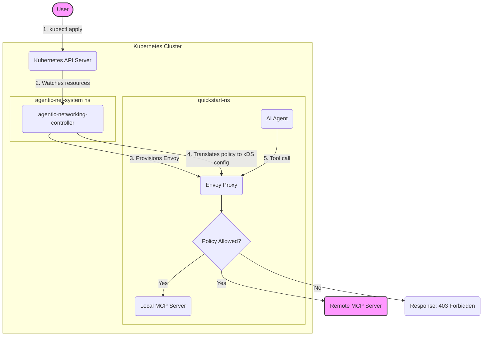

# Agentic Networking Quickstart

> ⚠️ **Disclaimer**: This quickstart demonstrates a proof-of-concept. The current implementation is not production-ready.

Welcome! This guide provides a hands-on walkthrough for getting started with the Kube Agentic Networking project. In just a few steps, you'll learn how to deploy an AI agent to your Kubernetes cluster and use declarative, high-level policies to control its access to various tools.

## Overview

The goal of this quickstart is to demonstrate how to use the Agentic Networking APIs to enforce fine-grained authorization policies on an AI agent. The agent will be running in your Kubernetes cluster and will attempt to access tools exposed by two different [Model Context Protocol (MCP)](https://modelcontextprotocol.io/docs/getting-started/intro) servers:

1.  **An in-cluster MCP server**: An instance of the [`everything` reference server](https://github.com/modelcontextprotocol/servers/tree/main/src/everything), running inside your cluster.
2.  **A remote MCP server**: The public [`DeepWiki` server](https://docs.devin.ai/work-with-devin/deepwiki-mcp), hosted externally.

You will define `XAccessPolicy` resources to specify which tools the agent is permitted to use from each server and observe how the Envoy proxy, configured by the Agentic Networking controller, enforces these rules.

Below is a high-level diagram illustrating this quickstart:




## 1. Prerequisites

Before you begin, ensure you have the following tools installed and configured:

- **A Kubernetes cluster**: Minimum version v1.35.0, with the PodCertificateRequest and ClusterTrustBundle features enabled. You can use a local cluster like `kind` or `minikube`, or a cloud-based one.
  ```shell
  kind create cluster --config=quickstart/kind-config.yaml
  ```
- **`kubectl`**: The Kubernetes command-line tool. See the [official installation guide](https://kubernetes.io/docs/tasks/tools/#kubectl).
- **A configured `kubectl` context**: Your `kubectl` should be pointing to the cluster you intend to use.
  ```shell
  kubectl config use-context <YOUR-CLUSTER-NAME>
  ```
- A local clone of this repository:
  ```shell
  git clone https://github.com/kubernetes-sigs/kube-agentic-networking.git
  cd kube-agentic-networking
  ```

## 2. Set Up the Kubernetes Environment

First, let's install the necessary Custom Resource Definitions (CRDs) and the in-cluster MCP server.

### Step 2.1: Install Gateway API CRDs

Agentic Networking builds upon the [Kubernetes Gateway API](https://gateway-api.sigs.k8s.io/). Install the standard CRDs with the following command ([official guide](https://gateway-api.sigs.k8s.io/guides/#installing-gateway-api)):

```shell
kubectl apply --server-side -f https://github.com/kubernetes-sigs/gateway-api/releases/download/v1.4.0/standard-install.yaml
```

### Step 2.2: Install Agentic Networking CRDs

Next, install the `XAccessPolicy` and `XBackend` CRDs specific to this project:

```shell
kubectl apply -f k8s/crds/agentic.prototype.x-k8s.io_xbackends.yaml
kubectl apply -f k8s/crds/agentic.prototype.x-k8s.io_xaccesspolicies.yaml
```

### Step 2.3: Create a namespace for the quickstart

```shell
kubectl create namespace quickstart-ns
```

### Step 2.4: Deploy the In-Cluster MCP Server

Deploy the `everything` MCP reference server, which will act as the local tool provider for our agent, into the `quickstart-ns` namespace.

```shell
kubectl apply -f quickstart/mcpserver/deployment.yaml
```

## 3. Deploy the Agentic Networking Controller

Now it's time to deploy the Agentic Networking controller. The controller runs in the cluster, watches for Gateway API and Agentic Networking resources (`XBackend`, `XAccessPolicy`), and manages the lifecycle of Envoy proxies.

Deploy the controller to the `agentic-net-system` namespace:

```shell
kubectl apply -f k8s/deploy/deployment.yaml
```

Create the root CA certificate that will be used to issue agent identies to your agents:
```shell
go run ./cmd/agentic-net-tool -- make-ca-pool-secret --ca-id=v1 --namespace=agentic-net-system --name=agentic-identity-ca-pool
```

Wait for the controller deployment to be ready:

```shell
kubectl wait --timeout=5m -n agentic-net-system deployment/agentic-net-controller --for=condition=Available
```

The controller will start running but won't do anything yet until we create a `Gateway` resource for it to manage.

## 4. Define and Apply Network Policies

Now, we'll define the core networking resources that describe our desired agent behavior. The `quickstart/policy/e2e.yaml` file contains all the necessary resources:

- **Gateway**: Defines an entry point for traffic, listening on port `10001`.
- **XBackend**: Two `XBackend` resources define the connection details for our local and remote MCP servers.
- **HTTPRoute**: Two `HTTPRoute` resources map URL paths (`/local/mcp` and `/remote/mcp`) to their respective `XBackend`.
- **XAccessPolicy**: Two `XAccessPolicy` resources define the access rules. They specify that the agent (`adk-agent-sa` service account) is only allowed to use the `add` and `getTinyImage` tools from the local server, and the `read_wiki_structure` tool from the remote server.

Apply these resources to the `quickstart-ns` namespace:

```shell
kubectl apply -f quickstart/policy/e2e.yaml
```

Once you apply these resources, the Agentic Networking controller will detect the new `Gateway` and automatically provision an Envoy proxy `Deployment` and `Service` in the Gateway namespace (`quickstart-ns`).

Wait for the Envoy proxy to be ready:

```shell
kubectl wait --timeout=5m -n quickstart-ns deployment -l "kube-agentic-networking.sigs.k8s.io/gateway-name=agentic-net-gateway" --for=condition=Available
```

This Envoy proxy is dynamically configured via xDS to enforce the `XAccessPolicy` rules you defined.

## 5. Deploy the AI Agent

The final piece is the AI agent itself. We'll use a sample agent built with the [Agent Development Kit (ADK)](https://google.github.io/adk-docs/).

### Step 5.1: Configure LLM Authentication

The agent's ability to understand requests and generate responses is powered by a Large Language Model (LLM). This guide uses a HuggingFace model ([deepseek-ai/DeepSeek-R1-0528](https://huggingface.co/deepseek-ai/DeepSeek-R1-0528)) accessed via `LiteLLM` for vendor neutrality.

To authenticate with the external HuggingFace model, you'll need a HuggingFace token. Obtain one by following [this guide](https://huggingface.co/docs/hub/en/security-tokens) and store it in a Kubernetes secret:

```shell
kubectl create secret generic hf-secret -n quickstart-ns --from-literal=hf-token-key='<YOUR-HUGGINGFACE-TOKEN>'
```

⚠️ **Warning**: Free-tier HuggingFace accounts have strict monthly rate limits, which are easily exceeded.

> **Note** You can use other HuggingFace models that support chat and tool calling by modifying the `HF_MODEL` environment variable in the [agent deployment manifest](/quickstart/adk-agent/deployment.yaml). For details on configuring other generative AI models with ADK agents, refer to the [ADK documentation](https://google.github.io/adk-docs/agents/models/).

### Step 5.2: Configure and Deploy the AI Agent

The agent uses an Envoy sidecar to establish mTLS-secured connections to the Gateway. We'll discover Gateway address and identity from your cluster and "plumb" it into the sidecar's configuration using environment variables.

1.  **Discover the Gateway address and identity**:
    Run these commands to extract the dynamic values and export them to your shell:

    ```shell
    # 1. Get the Gateway's internal IP address from its status
    export GATEWAY_ADDRESS=$(kubectl get gateway agentic-net-gateway -n quickstart-ns -o jsonpath='{.status.addresses[0].value}')

    # 2. Get the Gateway's ServiceAccount name to construct its SPIFFE identity
    export GATEWAY_SA=$(kubectl get sa -n quickstart-ns -l "kube-agentic-networking.sigs.k8s.io/gateway-name=agentic-net-gateway" -o jsonpath='{.items[0].metadata.name}')
    export GATEWAY_SPIFFE_ID="spiffe://cluster.local/ns/quickstart-ns/sa/${GATEWAY_SA}"
    
    echo "Gateway Address: $GATEWAY_ADDRESS"
    echo "Gateway SPIFFE ID: $GATEWAY_SPIFFE_ID"
    ```

1.  **Render and Apply the sidecar configuration**:
    Use the exported variables to render the ConfigMap template and apply it to the cluster:

    ```shell
    # Using envsubst (standard on most systems)
    envsubst < quickstart/adk-agent/sidecar/sidecar-configs.yaml | kubectl apply -f -
    ```

1.  **Deploy the agent**:
    ```shell
    kubectl apply -f quickstart/adk-agent/deployment.yaml
    ```

Wait for the deployment to complete and the agent to be ready:

```shell
kubectl wait --timeout=5m -n quickstart-ns deployment/adk-agent --for=condition=Available
```


## 6. Interact with the Agent

You can now interact with your agent through its web UI.

### Step 6.1: Access the Agent UI

We'll use port forwarding to access the agent's web UI from your local machine.

```shell
kubectl port-forward -n quickstart-ns service/adk-agent-svc 8081:80 &
```

Then, navigate to `http://localhost:8081` in your browser.

> **Note**
> If your cluster has a `LoadBalancer` implementation (e.g., in a cloud environment or a local setup like [MetalLB](https://metallb.io/installation/)), you can also access the agent via its external IP address. Get the agent's external IP address:
>
> ```shell
> kubectl get svc adk-agent-svc -n quickstart-ns -o jsonpath='{.status.loadBalancer.ingress[0].ip}'
> ```
>
> Open this IP address in your web browser.

### Step 6.2: Chat with the Agent

In the agent UI, select `mcp_agent` from the dropdown menu in the top-left corner. You can now send prompts to the agent.

Try the following prompts and observe the results. The outcomes are determined by the `XAccessPolicy` you deployed earlier.

| Prompt                                                           | Tool Invoked                        | Expected Result | Why?                                                                                                                                            |
| :--------------------------------------------------------------- | :---------------------------------- | :-------------- | :---------------------------------------------------------------------------------------------------------------------------------------------- |
| "What can you do for me?"                                        | `tools/list` on both MCPs           | ✅ **Success**  | The default policy allows any user to list available tools.<br/>(Note: Agent returns combined list of tools, filtering disallowed tools is WIP) |
| "Can you do 2+3?"                                                | `get-sum` on local MCP                  | ✅ **Success**  | The `XAccessPolicy` for the local backend explicitly allows the `get-sum` tool.                                                                     |
| "Can you echo back 'hello'?"                                     | `echo` on local MCP                 | ❌ **Failure**  | The `echo` tool is not in the allowlist for the local backend's `XAccessPolicy`.                                                                |
| "Read the structure of the `modelcontextprotocol/servers` repo." | `read_wiki_structure` on remote MCP | ✅ **Success**  | The `XAccessPolicy` for the remote backend explicitly allows this tool.                                                                         |
| "Read the wiki content of that repo."                            | `read_wiki_content` on remote MCP   | ❌ **Failure**  | The `read_wiki_content` tool is not in the allowlist for the remote backend.                                                                    |

<details>
<summary style="font-size: 1.5em; font-weight: bold;">🧪 Try Dynamic Policy Updates in Action</summary>

Want to see policy changes in action? Let's flip the script for the `local-mcp-backend`!

1.  **Edit the `XAccessPolicy`**: Open `quickstart/policy/e2e.yaml` and modify the `auth-policy-local-mcp` resource to:

    - **Remove** the `"get-sum"` tool.
    - **Add** the `"echo"` tool.

    Your `auth-policy-local-mcp` section should look like this:

    ```yaml
    apiVersion: agentic.prototype.x-k8s.io/v0alpha0
    kind: XAccessPolicy
    metadata:
      name: auth-policy-local-mcp
      namespace: quickstart-ns
    spec:
      targetRefs:
        - kind: XBackend
          name: local-mcp-backend
      rules:
        - name: updated-rule
          source:
            type: ServiceAccount
            serviceAccount:
              name: adk-agent-sa
          authorization:
            type: InlineTools
            tools:
              - "get-tiny-image"
              - "echo" # Now allowed!
    ```

2.  **Apply the updated policy**:

    ```shell
    kubectl apply -n quickstart-ns -f quickstart/policy/e2e.yaml
    ```

3.  **The controller will automatically update Envoy**: The Agentic Networking controller will detect the change to the `XAccessPolicy` and dynamically update the running Envoy proxy with the new rules via xDS. No restart is needed!

4.  **Interact with the Agent again**: Go back to `http://localhost:8081` and try these prompts:

    | Prompt                       | Tool Invoked        | Expected Result | Why?                                                               |
    | :--------------------------- | :------------------ | :-------------- | :----------------------------------------------------------------- |
    | "Can you do 2+3?"            | `get-sum` on local MCP  | ❌ **Failure**  | The `get-sum` tool is now _disallowed_ by the updated `XAccessPolicy`. |
    | "Can you echo back 'hello'?" | `echo` on local MCP | ✅ **Success**  | The `echo` tool is now _allowed_ by the updated `XAccessPolicy`.   |

    Observe how the agent's behavior changes instantly based on your policy modifications!

    </details>

## 7. Recap

Congratulations! You have successfully:

- Installed the Agentic Networking CRDs.
- Deployed the Agentic Networking controller.
- Defined declarative authorization policies for an AI agent using `Gateway`, `HTTPRoute`, `XBackend`, and `XAccessPolicy` resources.
- Observed the controller automatically provision and configure an Envoy proxy to enforce those policies.
- Verified that the agent's access to tools is controlled at the network level.

## 8. Clean Up

To remove all the resources created during this quickstart, run the following commands:

```shell
# Delete the namespace for the quickstart application, which includes the agent, policies, MCP server, and the Envoy proxy.
kubectl delete namespace quickstart-ns

# Delete the controller, its namespace, and associated RBAC
kubectl delete -f k8s/deploy/deployment.yaml

# Uninstall Agentic Networking CRDs
kubectl delete -f k8s/crds/agentic.prototype.x-k8s.io_xaccesspolicies.yaml
kubectl delete -f k8s/crds/agentic.prototype.x-k8s.io_xbackends.yaml

# Uninstall Gateway API CRDs
kubectl delete -f https://github.com/kubernetes-sigs/gateway-api/releases/download/v1.4.0/standard-install.yaml
```
