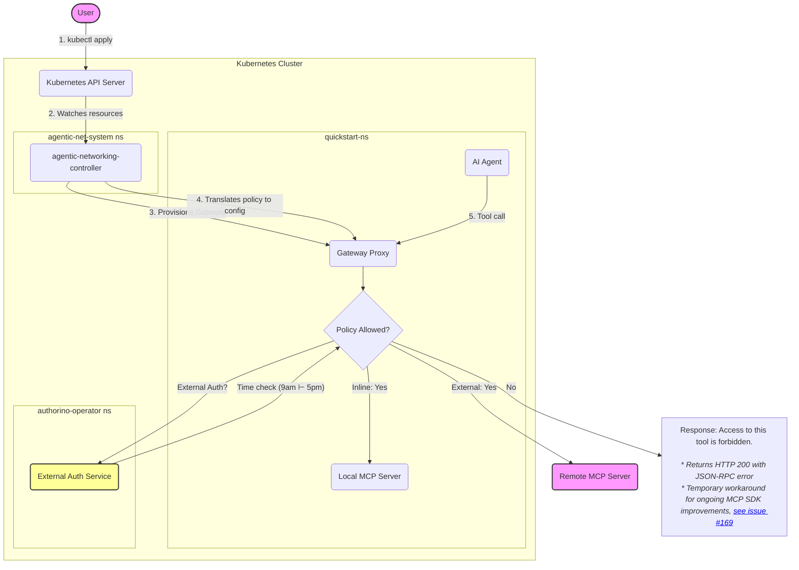

# External Authorization Quickstart

> ⚠️ **Disclaimer**: This quickstart demonstrates a proof-of-concept. The current implementation is not production-ready.

Welcome! This guide demonstrates how to integrate **external authorization** with the Kube Agentic Networking project. You'll deploy an AI agent to your Kubernetes cluster and use an external authorizer to enforce custom access control logic on agentic network traffic.

## Overview

This quickstart builds on the [main Agentic Networking Quickstart](../quickstart/README.md) by adding an external authorization layer. Instead of using inline tool allowlists, you'll delegate access control decisions to an external authorization service.

In this example, we'll use [Authorino](https://github.com/kuadrant/authorino)[^1]. You can choose any external authorizer supported by your Agentic Networking implementation.

[^1]: Authorino is a Kubernetes-native authorization service that is part of the [Kuadrant](https://kuadrant.io/) CNCF project.

The agent will attempt to access tools from two MCP servers:
1. **Local MCP backend**: Controlled by an inline tool allowlist (`InlineTools` authorization type)
2. **Remote MCP backend**: Controlled by an external authorizer (`ExternalAuth` authorization type)

In this example, the external authorizer enforces a **time-based access policy** — the agent can only access remote MCP tools starting at 9am and before 5pm.

Below is a high-level diagram illustrating this quickstart:



## Prerequisites

Before you begin, ensure you have the following:

- **[git](https://git-scm.com/downloads)**
- **[kind](https://kind.sigs.k8s.io/docs/user/quick-start/#installation)** (Kubernetes in Docker)
- **[kubectl](https://kubernetes.io/docs/tasks/tools/#kubectl)**
- **[Go](https://go.dev/doc/install)** (1.23+)
- **[envsubst](https://www.gnu.org/software/gettext/manual/html_node/envsubst-Invocation.html)** (typically included with `gettext`)
- **[Helm](https://helm.sh/docs/intro/install/)** (for deploying Authorino)
- **A HuggingFace token** with ***"Make calls to Inference Providers"*** permission enabled. Follow [this guide](https://huggingface.co/docs/hub/en/security-tokens) to create one.

> **Warning**: Free-tier HuggingFace accounts have strict monthly rate limits, which are easily exceeded.

## Quickstart

```shell
# 1. Clone the repository
git clone https://github.com/kubernetes-sigs/kube-agentic-networking.git
cd kube-agentic-networking

# 2. Set your HuggingFace token
export HF_TOKEN=<your-huggingface-token>

# 3. Run the external auth quickstart setup
bash site-src/guides/external-auth-quickstart/run-external-auth-quickstart.sh

# 4. Open the agent UI at http://localhost:8081/dev-ui/?app=mcp_agent
```

### What the Script Does

The `run-external-auth-quickstart.sh` script performs the following steps:

1. **Runs the base quickstart** by calling [`run-quickstart.sh`](../quickstart/run-quickstart.sh), which sets up:
   - A local Kubernetes (using Kind)
   - Gateway API and Agentic Networking CRDs
   - The Agentic Networking controller
   - In-cluster MCP server (the `everything` reference server)
   - Network wiring: `Gateway`, `HTTPRoutes`, `XBackends`
   - Sample `XAccessPolicies` for both backends
   - The AI agent with an Envoy sidecar (configured with the discovered gateway address and SPIFFE identity)
   - Port-forwarding to the agent UI on `localhost:8081`
2. **Deploys the external authorization service**:
   - Installs Authorino Operator (using Helm)
   - Creates an instance of the authorization service
   - Configures time-based access rules (9am ⊢ 5pm) for all hosts delegating authorization to the service
3. **Applies external auth policies** by updating the `XAccessPolicy` for the remote MCP backend to use `ExternalAuth` type

## Understanding External Authorization Policies

The key difference in this quickstart is the `XAccessPolicy` for the remote MCP backend. Let's examine how it's configured:

```yaml
apiVersion: agentic.prototype.x-k8s.io/v0alpha0
kind: XAccessPolicy
metadata:
  name: auth-policy-remote-mcp
  namespace: quickstart-ns
spec:
  targetRefs:
    - group: agentic.prototype.x-k8s.io
      kind: XBackend
      name: remote-mcp-backend
  rules:
    - name: ext-authorizer-for-adk-agent-sa
      source:
        type: ServiceAccount
        serviceAccount:
          name: adk-agent-sa
          namespace: quickstart-ns
      authorization:
        type: ExternalAuth
        externalAuth:
          backendRef:
            kind: Service
            name: authorino-authorino-authorization
            namespace: authorino-operator
            port: 50051
          protocol: GRPC
          grpc: {}
```

**Key components:**

- **`authorization.type: ExternalAuth`**: Delegates authorization decisions to an external service instead of using inline rules
- **`externalAuth.backendRef`**: Points to the external authorization service
- **`protocol: GRPC`**: Specifies the protocol to communicate with the external authorizer

When the agent attempts to call a tool on the remote MCP backend, the gateway will:
1. Intercept the request
2. Call the external authorization service via gRPC
3. Include request metadata (time, identity, etc.)
4. Allow or deny based on the authorizer's response

In this example, the `AuthConfig` resource contains the actual authorization logic:

```yaml
apiVersion: authorino.kuadrant.io/v1beta3
kind: AuthConfig
metadata:
  name: external-auth-config
  namespace: authorino-operator
spec:
  hosts:
  - '*'
  authorization:
    "from-9am-to-5pm":
      opa:
        rego: |
          hour := time.clock(input.request.time.seconds*1000000000+input.request.time.nanos)[0]
          allow { hour >= 9; hour < 17 }
```

This Rego policy extracts the hour from the request timestamp and allows access only if the hour is greater than or equal to 9 (9am) and less than 17 (5pm).

Notice the time is always given at UTC 😉.

## Chat with the Agent

In the agent UI, ensure `mcp_agent` is selected from the dropdown menu. Try the following prompts:

| Prompt                                                                             | When                    | Tool Invoked                        | Expected Result | Why?                                                                              |
| :--------------------------------------------------------------------------------- | :---------------------- | :---------------------------------- | :-------------- | :-------------------------------------------------------------------------------- |
| What can you do?                                                                   | Any time                | `tools/list` on both MCPs           | ✅ **Success**   | The default policy allows any user to list available tools.                       |
| What is the sum of 2 and 3?                                                        | Any time                | `get-sum` on local MCP              | ✅ **Success**   | The `XAccessPolicy` for the local backend allows the `get-sum` tool.              |
| Echo back 'hello'.                                                                 | Any time                | `echo` on local MCP                 | ❌ **Failure**   | The `echo` tool is not in the allowlist for the local backend.                    |
| Read the wiki structure of the GitHub repo kubernetes-sigs/kube-agentic-networking | Between 9am and 5pm     | `read_wiki_structure` on remote MCP | ✅ **Success**   | External authorizer allows requests during business hours.                        |
| Read the wiki structure of the GitHub repo kubernetes-sigs/kube-agentic-networking | Before 9am or after 5pm | `read_wiki_structure` on remote MCP | ❌ **Failure**   | External authorizer denies requests outside business hours.                       |
| What's the GitHub repo kubernetes-sigs/kube-agentic-networking?                    | Between 9am and 5pm     | `ask_question` on remote MCP        | ✅ **Success**   | External authorizer allows requests during business hours.                        |

*Note: The external auth policy applies to **all tools** on the remote MCP backend. Unlike the inline policy (which specifies individual tools), the time-based rule affects access to any remote tool.*

<details markdown="1">
<summary style="font-size: 1.5em; font-weight: bold;">🧪 Try Dynamic Policy Updates in Action</summary>

Want to see how changes to the external authorization service take effect? Let's modify the time-based access window!

1. **Update the `AuthConfig`** to allow access only between **10am and 4pm**:

    ```shell
    kubectl apply -f - <<EOF
    apiVersion: authorino.kuadrant.io/v1beta3
    kind: AuthConfig
    metadata:
      name: external-auth-config
      namespace: authorino-operator
    spec:
      hosts:
      - '*'
      authorization:
        "from-10am-to-4pm":
          opa:
            rego: |
              hour := time.clock(input.request.time.seconds*1000000000+input.request.time.nanos)[0]
              allow { hour >= 10; hour < 16 }
    EOF
    ```

2. **Wait a moment** for the external authorization service to reload the configuration (usually takes 1-2 seconds).

3. **Interact with the Agent again**: Go back to `http://localhost:8081` and try these prompts:

    | Prompt                                                                             | When                       | Tool Invoked                        | Expected Result | Why?                                                         |
    | :--------------------------------------------------------------------------------- | :------------------------- | :---------------------------------- | :-------------- | :----------------------------------------------------------- |
    | What is the sum of 2 and 3?                                                        | Any time                   | `get-sum` on local MCP              | ✅ **Success**   | Local backend policy is unchanged (inline allowlist).        |
    | Read the wiki structure of the GitHub repo kubernetes-sigs/kube-agentic-networking | Between 10am and 3pm       | `read_wiki_structure` on remote MCP | ✅ **Success**   | External authorizer allows requests during the new window.   |
    | Read the wiki structure of the GitHub repo kubernetes-sigs/kube-agentic-networking | Before 9-10am or after 4pm | `read_wiki_structure` on remote MCP | ❌ **Failure**   | External authorizer denies requests outside the new window.  |

   Observe how the agent's behavior changes based on the updated external authorization rules!

**Key insight**: You modified the external service's configuration, not the **`XAccessPolicy`**. The `XAccessPolicy` remains unchanged — it simply points to the external authorization service where the custom logic lives.

This demonstrates the power of external authorization: decouple policy enforcement (managed by Agentic Networking) from policy logic (managed by your authorization service).

</details>

## Clean Up

To remove all resources created during this quickstart:

```shell
kind delete cluster --name kan-quickstart
```

This deletes the entire kind cluster and all resources within it, including the external authorization service and all policies.

> **Note**: If you used `HF_TOKEN` only for this quickstart, you may also want to revoke or delete the token from your [HuggingFace settings](https://huggingface.co/settings/tokens).

## FAQs

For general troubleshooting and frequently asked questions, see the [main Quickstart FAQ](../quickstart/README.md#faqs).

### External Auth Specific FAQs

**Q: Can I use a different external authorizer?**

A: The Agentic Networking implementation provided with this Quickstart uses Envoy as the gateway proxy, so any service that implements Envoy's [External Authorization protocol](https://www.envoyproxy.io/docs/envoy/latest/intro/arch_overview/security/ext_authz_filter) (gRPC or HTTP) will work. For other Agentic Networking implementations, make sure to confirm which external authorization services are supported.

Popular CNCF alternatives for Envoy-based implementations include:
- [Open Policy Agent (OPA)](https://www.openpolicyagent.org/docs/latest/envoy-introduction/) with the Envoy plugin
- Custom authorization services implementing the External Authorization protocol

Simply update the `externalAuth.backendRef` in your `XAccessPolicy` to point to your authorizer's service.

**Q: What happens if the external authorizer is unavailable?**

A: In the reference implementation, if the gateway cannot reach the external authorizer, the default behavior is to **deny** the request. This fail-closed approach ensures that access is not granted when the authorization system is down. The specific failure behavior may vary depending on your Agentic Networking implementation and gateway configuration.

**Q: Can I combine `InlineTools` and `ExternalAuth` in the same policy?**

A: Yes, you can create multiple rules targeting the same gateway or backend, each with different sources and authorization types. However, there is currently a maximum of one authorization rule with type `ExternalAuth` per policy, but a policy can combine multiple `InlineTools` rules with one `ExternalAuth` rule. The controller will merge these rules appropriately.

**Q: How does the external authorizer receive request context?**

A: The request context sent to the external authorizer depends on your Agentic Networking implementation. In the reference implementation (Envoy-based), the gateway sends rich context including:
- Request headers, method, and path
- Client identity (SPIFFE ID from mTLS)
- Timestamp
- Additional attributes

In this quickstart, the external authorization service uses the request timestamp (`input.request.time` in the Rego policy) to make time-based access decisions.

For details on the Envoy external authorization payload, see the [`CheckRequest`](https://www.envoyproxy.io/docs/envoy/latest/api-v3/service/auth/v3/external_auth.proto#envoy-v3-api-msg-service-auth-v3-checkrequest) proto message specification.

Authorino bindings to Envoy's external authorization request include `request.headers`, `request.url_path`, `source.principal`, `destination.address`, and several others. See the [`WellKnownAttributes`](https://pkg.go.dev/github.com/kuadrant/authorino/pkg/service#WellKnownAttributes) specification for the full list.
