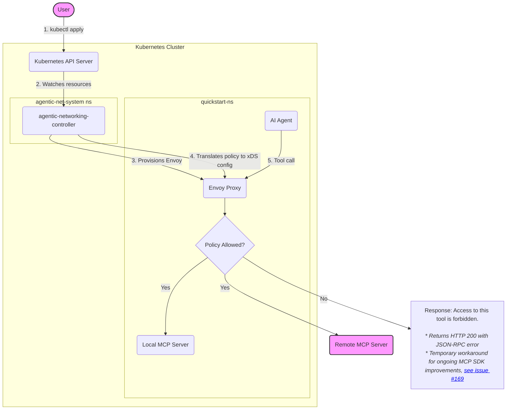

# Agentic Networking Quickstart

> ⚠️ **Disclaimer**: This quickstart demonstrates a proof-of-concept. The current implementation is not production-ready.

Welcome! This guide provides a hands-on walkthrough for getting started with the Kube Agentic Networking project. In just a few steps, you'll learn how to deploy an AI agent to your Kubernetes cluster and use declarative, high-level policies to control its access to various tools.

## Overview

The goal of this quickstart is to demonstrate how to use the Agentic Networking APIs to enforce fine-grained authorization policies on an AI agent. The agent will be running in your Kubernetes cluster and will attempt to access tools exposed by two different [Model Context Protocol (MCP)](https://modelcontextprotocol.io/docs/getting-started/intro) servers:

1.  **An in-cluster MCP server**: An instance of the [`everything` reference server](https://github.com/modelcontextprotocol/servers/tree/main/src/everything), running inside your cluster.
2.  **A remote MCP server**: The public [`DeepWiki` server](https://docs.devin.ai/work-with-devin/deepwiki-mcp), hosted externally.

You will define `XAccessPolicy` resources to specify which tools the agent is permitted to use from each server and observe how the Envoy proxy, configured by the Agentic Networking controller, enforces these rules.

Below is a high-level diagram illustrating this quickstart:



## Prerequisites

Before you begin, ensure you have the following:

- **[git](https://git-scm.com/downloads)**
- **[kind](https://kind.sigs.k8s.io/docs/user/quick-start/#installation)** (Kubernetes in Docker)
- **[kubectl](https://kubernetes.io/docs/tasks/tools/#kubectl)**
- **[Go](https://go.dev/doc/install)** (1.23+)
- **[envsubst](https://www.gnu.org/software/gettext/manual/html_node/envsubst-Invocation.html)** (typically included with `gettext`)

**Choose one of the following LLM options:**

### Option 1: HuggingFace (Default)
- **A HuggingFace token** with ***"Make calls to Inference Providers"*** permission enabled. Follow [this guide](https://huggingface.co/docs/hub/en/security-tokens) to create one.

> **Warning**: Free-tier HuggingFace accounts have strict monthly rate limits, which are easily exceeded.

### Option 2: Ollama (Local)
- **[Ollama](https://ollama.com/)** installed and running locally
- **Note**: Local models may have slower response times compared to cloud-hosted inference APIs, depending on your hardware (CPU/GPU) and the model size.
- A model pulled (e.g., `ollama pull qwen2.5:7b`)

## Quickstart

### Option 1: Using HuggingFace (Default)

```shell
# 1. Clone the repository
git clone https://github.com/kubernetes-sigs/kube-agentic-networking.git
cd kube-agentic-networking

# 2. Set your HuggingFace token
export HF_TOKEN=<your-huggingface-token>

# 3. Run the quickstart setup
make quickstart

# 4. Open the agent UI at http://localhost:8081/dev-ui/?app=mcp_agent
```

### Option 2: Using Ollama (No HF_TOKEN Required)

```shell
# 1. Clone the repository
git clone https://github.com/kubernetes-sigs/kube-agentic-networking.git
cd kube-agentic-networking

# 2. Ensure Ollama is running locally
ollama serve  # If not already running
ollama pull qwen2.5:7b  # Or your preferred model

# 3. Run the quickstart setup with Ollama
make quickstart-ollama

# 4. Open the agent UI at http://localhost:8081/dev-ui/?app=mcp_agent
```

> **Note**: The default Ollama URL (`http://host.docker.internal:11434`) works on some operating systems like MacOS, where `host.docker.internal` resolves to the host machine's IP address from within containers.
>
> **For Linux users**: See the [Ollama Linux Setup Guide](adk-agent/ollama_linux_setup.md) for detailed instructions on configuring Ollama to work with kind clusters.

**Advanced Ollama Options:**

```shell
# Use a different Ollama server or model
./site-src/guides/quickstart/run-quickstart.sh \
  --ollama \
  --ollama-url http://host.docker.internal:11434 \
  --ollama-model llama3.2

# See all options
./site-src/guides/quickstart/run-quickstart.sh --help
```

### What `make quickstart` Does

`make quickstart` automates the entire setup by running [`run-quickstart.sh`](https://github.com/kubernetes-sigs/kube-agentic-networking/blob/main/site-src/guides/quickstart/run-quickstart.sh):

1. **Creates a kind cluster** (`kan-quickstart`) with Kubernetes v1.35 and required feature gates enabled.
2. **Installs Gateway API CRDs** (standard v1.4.0 install).
3. **Installs Agentic Networking CRDs** (`XBackend` and `XAccessPolicy`).
4. **Creates the `quickstart-ns` namespace**.
5. **Deploys the in-cluster MCP server** (the `everything` reference server).
6. **Deploys the Agentic Networking controller** and creates the CA pool secret for mTLS identity.
7. **Applies network policies** (Gateway, HTTPRoutes, XBackends, XAccessPolicies) and waits for the Envoy proxy to be provisioned.
8. **Deploys the AI agent** with an Envoy sidecar, configured with the discovered Gateway address and SPIFFE identity.
9. **Sets up port-forwarding** to the agent UI on `localhost:8081`.

## Chat with the Agent

In the agent UI, ensure `mcp_agent` is selected from the dropdown menu in the top-left corner. Try the following prompts:

| Prompt                                                                               | Tool Invoked                        | Expected Result | Why?                                                                                                                                            |
| :----------------------------------------------------------------------------------- | :---------------------------------- | :-------------- | :---------------------------------------------------------------------------------------------------------------------------------------------- |
| What can you do?                                                                     | `tools/list` on both MCPs           | ✅ **Success**   | The default policy allows any user to list available tools.<br/>(Note: Agent returns combined list of tools, filtering disallowed tools is WIP) |
| What is the sum of 2 and 3?                                                          | `get-sum` on local MCP              | ✅ **Success**   | The `XAccessPolicy` for the local backend explicitly allows the `get-sum` tool.                                                                 |
| Echo back 'hello'.                                                                   | `echo` on local MCP                 | ❌ **Failure**   | The `echo` tool is not in the allowlist for the local backend's `XAccessPolicy`.                                                                |
| Read the wiki structure of the GitHub repo kubernetes-sigs/kube-agentic-networking   | `read_wiki_structure` on remote MCP | ✅ **Success**   | The `XAccessPolicy` for the remote backend explicitly allows this tool.                                                                         |
| Read the wiki content of the GitHub repo kubernetes-sigs/kube-agentic-networking     | `read_wiki_content` on remote MCP   | ❌ **Failure**   | The `read_wiki_content` tool is not in the allowlist for the remote backend.                                                                    |
| How to contribute to the GitHub repo kubernetes-sigs/kube-agentic-networking         | `ask_question` on remote MCP        | ❌ **Failure**   | The `ask_question` tool is not in the allowlist for the remote backend.                                                                         |

*Note: The `XAccessPolicy` resources used in this quickstart are defined [here](https://github.com/kubernetes-sigs/kube-agentic-networking/blob/main/site-src/guides/quickstart/policy/e2e.yaml).*

<details markdown="1">
<summary style="font-size: 1.5em; font-weight: bold;">🧪 Try Dynamic Policy Updates in Action</summary>

Want to see policy changes in action? Let's flip the script for the `local-mcp-backend`!

1. **Edit the `XAccessPolicy`**: Open `site-src/guides/quickstart/policy/e2e.yaml` and modify the `auth-policy-local-mcp` resource to:
   - **Remove** the `"get-sum"` tool.
   - **Add** the `"echo"` tool.

   Your `auth-policy-local-mcp` section should look like this:

   ```yaml
   apiVersion: agentic.prototype.x-k8s.io/v0alpha0
   kind: XAccessPolicy
   metadata:
     name: auth-policy-local-mcp
     namespace: quickstart-ns
   spec:
     targetRefs:
       - kind: XBackend
         name: local-mcp-backend
     rules:
       - name: updated-rule
         source:
           type: ServiceAccount
           serviceAccount:
             name: adk-agent-sa
         authorization:
           type: InlineTools
           tools:
             - "get-tiny-image"
             - "echo" # Now allowed!
   ```

2. **Apply the updated policy**:

   ```shell
   kubectl apply -n quickstart-ns -f site-src/guides/quickstart/policy/e2e.yaml
   ```

3. **Wait for the controller to update Envoy**: The Agentic Networking controller will detect the change to the `XAccessPolicy` and dynamically update the running Envoy proxy with the new rules via xDS. No restart is needed!

4. **Interact with the Agent again**: Go back to `http://localhost:8081` and try these prompts:

    | Prompt                      | Tool Invoked           | Expected Result | Why?                                                                   |
    | :-------------------------- | :--------------------- | :-------------- | :--------------------------------------------------------------------- |
    | What is the sum of 2 and 3? | `get-sum` on local MCP | ❌ **Failure**   | The `get-sum` tool is now _disallowed_ by the updated `XAccessPolicy`. |
    | Echo back 'hello'.          | `echo` on local MCP    | ✅ **Success**   | The `echo` tool is now _allowed_ by the updated `XAccessPolicy`.       |

   Observe how the agent's behavior changes instantly based on your policy modifications!

</details>

<details markdown="1">
<summary style="font-size: 1.5em; font-weight: bold;">Bring Your Own Agent (Optional)</summary>

The quickstart script already deployed the sample ADK agent with a fully configured Envoy sidecar. The steps below are only needed if you want to integrate a **different** agent of your own into the Agentic Networking infrastructure.

**Prerequisites**

- You have completed the quickstart (the kind cluster, controller, and Gateway are running)
- Your agent deployment, service, and MCP tools are running
- Your agent can communicate with MCP tool servers

**Step 1: Ensure your agent has a ServiceAccount**

The mTLS identity system issues SPIFFE certificates based on the pod's ServiceAccount. The resulting identity will be `spiffe://cluster.local/ns/<namespace>/sa/<service-account>`, which is used for RBAC policy matching.

If your agent already has a `ServiceAccount`, note its name. Otherwise, create one and update your deployment:

```shell
kubectl create serviceaccount <agent-sa> -n <agent-namespace>
kubectl set serviceaccount deployment/<agent-deployment> <agent-sa> -n <agent-namespace>
```

**Step 2: Define or update access policies**

Update `XBackend`, `XAccessPolicy`, and `HTTPRoute` resources to reference your agent's ServiceAccount and tool endpoints (see the `site-src/guides/quickstart/policy/e2e.yaml` file for examples):

```shell
kubectl apply -f <policy-file>.yaml
```

**Step 3: Create the Envoy sidecar ConfigMap**

The Envoy sidecar needs a ConfigMap with its bootstrap and SDS configurations for mTLS. Use the template at [`site-src/guides/quickstart/adk-agent/sidecar/sidecar-configs.yaml`](https://github.com/kubernetes-sigs/kube-agentic-networking/blob/main/site-src/guides/quickstart/adk-agent/sidecar/sidecar-configs.yaml):

1.  **Copy the template** and update `metadata.namespace` to your agent's namespace:

    ```shell
    cp site-src/guides/quickstart/adk-agent/sidecar/sidecar-configs.yaml <your-sidecar-configs>.yaml
    ```

1.  **Discover the Gateway address and identity**, then **render and apply**:

    ```shell
    export GATEWAY_ADDRESS=$(kubectl get gateway agentic-net-gateway -n <gateway-namespace> -o jsonpath='{.status.addresses[0].value}')
    export GATEWAY_SA=$(kubectl get sa -n <gateway-namespace> --no-headers -o custom-columns=":metadata.name" | grep "envoy-proxy-" | head -n 1)
    export GATEWAY_SPIFFE_ID="spiffe://cluster.local/ns/<gateway-namespace>/sa/${GATEWAY_SA}"
    envsubst < <your-sidecar-configs>.yaml | kubectl apply -f -
    ```

**Step 4: Add the Envoy sidecar to your agent deployment**

Add an **`envoy` sidecar container** to your Deployment spec with the `envoy-sidecar-configs` and `agent-identity-mtls` volumes. The `envoy-sidecar-configs` tells Envoy how to connect, and `agent-identity-mtls` gives it the credentials to authenticate (see the [ADK agent deployment](https://github.com/kubernetes-sigs/kube-agentic-networking/blob/main/site-src/guides/quickstart/adk-agent/deployment.yaml) for reference). Add `--disable-hot-restart` to the Envoy args if the hot restart socket conflicts in your environment.

> **Note**: The ADK agent deployment also includes a `proxy-init` init container with iptables rules. This is **not required** — the Envoy sidecar already listens on port 10001 within the pod, so `127.0.0.1:10001` reaches it directly. Omitting it avoids the `NET_ADMIN` capability requirement and speeds up pod startup.

**Step 5: Configure your agent to route through Envoy**

Update your agent's tool endpoint to use the local Envoy sidecar. Use **plain HTTP** (not HTTPS) — the sidecar handles mTLS to the Gateway transparently:

```shell
kubectl set env deployment/<agent-deployment> \
  TOOL_ENDPOINT=http://127.0.0.1:10001/<route-path> \
  -n <agent-namespace>
```

The exact configuration method depends on how your agent connects to MCP tools.

</details>

## Clean Up

To remove all resources created during this quickstart:

```shell
kind delete cluster --name kan-quickstart
```

This deletes the entire kind cluster and all resources within it.

> **Note**: If you used `HF_TOKEN` only for this quickstart, you may also want to revoke or delete the token from your [HuggingFace settings](https://huggingface.co/settings/tokens).


## FAQs

Q: I see errors like `litellm.BadRequestError: HuggingfaceException - {"object":"error","message":"Backend Error",...}`. How can I resolve this?

A: Hugging Face model public inferencing endpoints can be unstable. As a quick mitigation, point the agent at a different model by overriding the HF_MODEL env var in the agent deployment and restart the pods.

Examples of alternative model IDs to try:

- huggingface/deepseek-ai/DeepSeek-V3.2
- huggingface/Qwen/Qwen3.5-27B
- huggingface/Qwen/Qwen3.5-9B

Override via kubectl (replace <model-id> as needed):

```shell
export HF_MODEL="<model-id>"
kubectl set env deployment/adk-agent -n quickstart-ns HF_MODEL=$HF_MODEL
kubectl rollout restart deployment/adk-agent -n quickstart-ns
```

Tips:

- Try smaller models first to avoid backend load/timeouts.
- Check agent and sidecar logs for more details when errors occur.
- Consider a paid Hugging Face Inference API or self-hosting if reliability is critical.
