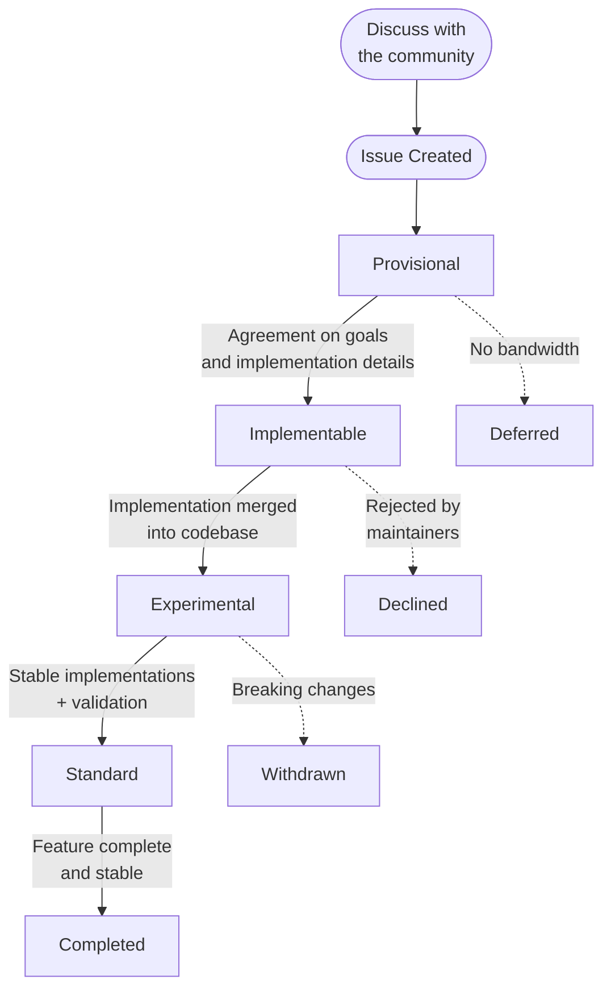

# Kubernetes Agentic Networking Enhancement Proposal

Kubernetes Agentic Networking Enhancement Proposals serve a similar purpose to the [KEP][kep]
process for the main Kubernetes project and the [GEP][gep] process for Gateway API:

1. Ensure that changes to the API follow a known process and discussion
  in the OSS community.
2. Make changes and proposals discoverable (current and future).
3. Document design ideas, tradeoffs, decisions that were made for
  historical reference.
4. Record the results of larger community discussions.

[kep]: https://github.com/kubernetes/enhancements/blob/master/keps/README.md
[gep]: https://gateway-api.sigs.k8s.io/geps/overview/

## Process

Enhancement proposals follow a structured process from initial discussion through to implementation:

## Proposal States

Each proposal has a state that tracks where it is in the process:

**States that can be reached from any other state:**

  * **Deferred:** We do not currently have bandwidth to handle this proposal, it
    may be revisited in the future.
  * **Declined:** This proposal was considered by the community but ultimately
    rejected and further work will not occur.
  * **Withdrawn:** This proposal was considered by the community but ultimately
    withdrawn by the author.

**Active development states:**

  * **Provisional:** The goals described by this proposal have consensus but
    implementation details have not been agreed to yet.
  * **Implementable:** The goals and implementation details described by this proposal
    have consensus but have not been fully implemented yet.
  * **Experimental:** This proposal has been implemented and is part of the
    "Experimental" release channel. Breaking changes are still possible, up to
    and including complete removal.
  * **Standard:** This proposal has been implemented and is part of the
    "Standard" release channel. It should be quite stable.
  * **Completed:** All implementation work on this proposal has been completed
    and the feature is stable.

## Process Details

### 1. Discuss with the community

Before creating a proposal, share your high-level idea with the community. There are
several places this may be done:

- A [new Github discussion](https://github.com/kubernetes-sigs/kube-agentic-networking/discussions/new)
- On our [Slack channel](https://kubernetes.slack.com/archives/C09P6KS6EQZ)
- On our [community meetings](../contributing/index.md#meetings)

Please default to GitHub discussions: they work a lot like GitHub issues which
makes them easy to search.

### 2. Create an Issue

Create an enhancement issue in the repo describing your change. At this point, you should
document the outcome of any conversations or preliminary discussions.

### 3. `Provisional` - Agree on the Goals

The first version of your proposal should aim for "Provisional" status and focus on:

- **Who** the proposal is for (personas)
- **What** the proposal will do (goals and non-goals)
- **Why** it is needed (motivation and use cases)

Leave implementation details for the next phase. This ensures community alignment on
the problem before investing in detailed solutions.

### 4. `Implementable` - Document Implementation Details

Now that everyone agrees on the goals, document your proposed implementation:

- Proposed API specifications
- Edge cases and error handling
- Alternatives considered and why they were not chosen
- Test scenarios

### 5. `Experimental` - Implement the Changes

With the proposal marked as "Implementable", make the actual changes. All new features
should be clearly marked as experimental when introduced.

### 6. `Standard` - Stabilize the Feature

After implementation, validation, and community feedback, the feature can move to
standard status indicating stability and production-readiness.
